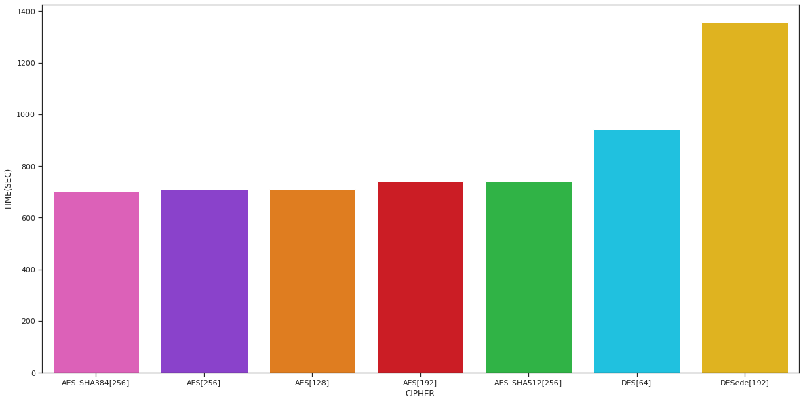

#


```python
import pandas as pd
import numpy as np
import seaborn as sns
import matplotlib.pyplot as plt
sns.set_theme(style="ticks", color_codes=True)
plt.rcParams["figure.figsize"] = (20,10)
```

# Funciones de utileria


```python
def getTasa(time,corpus_size):
    corpus_size_bits = corpus_size*8
    corpus_size_mb   = corpus_size/125000
    tasa_bits_secs   = corpus_size_bits/time
    tasa_bytes_secs  = corpus_size/time
    tasa_mb_secs     = corpus_size_mb/time
    return {'BITS/SEC':(corpus_size_bits,tasa_bits_secs),'BYTES/SEC':(corpus_size,tasa_bytes_secs),'MB/SEC':(corpus_size_mb,tasa_mb_secs)}

def getInfo(**kwargs):
    dfa              = kwargs.get('df') 
    time             = dfa.TIME.sum()/1000
    time_min         = time/60
    corpus_size      = dfa.FILE_SIZE.sum()
    tasas            = getTasa(time,corpus_size)
    tasa_bits_secs   = tasas['BITS/SEC']
    tasa_bytes_secs  = tasas['BYTES/SEC']
    tasa_mb_secs     = tasas['MB/SEC']
    keyLen           = dfa.KEY_LENGTH.unique()[0]
    cipher           = dfa.CIPHER.unique()[0]+"[{}]".format(keyLen)
    
    return (cipher,time,time_min,*tasa_bits_secs,*tasa_bytes_secs,*tasa_mb_secs)
    
```

# Cipher(Encrypt mode)


```python
df      = pd.read_csv('data.csv')
des     = df.loc[df.CIPHER=='DES']
desede  = df.loc[df.CIPHER=='DESede']
aes_128 = df.loc[df.CIPHER=='AES'].loc[df.KEY_LENGTH==128]
aes_192 = df.loc[df.CIPHER=='AES'].loc[df.KEY_LENGTH==192]
aes_256 = df.loc[df.CIPHER=='AES'].loc[df.KEY_LENGTH==256].loc[df.KDF!='PBKDF2WithHmacSHA384'].loc[df.KDF!='PBKDF2WithHmacSHA512']
# 
aes_256_sha384 = df.loc[df.CIPHER=='AES'].loc[df.KEY_LENGTH==256].loc[df.KDF=='PBKDF2WithHmacSHA384']
df.loc[aes_256_sha384.index,'CIPHER']="AES_SHA384"
aes_256_sha384 = df.loc[df.CIPHER=='AES_SHA384'].loc[df.KEY_LENGTH==256].loc[df.KDF=='PBKDF2WithHmacSHA384']
# 
aes_256_sha512 = df.loc[df.CIPHER=='AES'].loc[df.KEY_LENGTH==256].loc[df.KDF=='PBKDF2WithHmacSHA512']
df.loc[aes_256_sha512.index,'CIPHER']="AES_SHA512"
aes_256_sha512 = df.loc[df.CIPHER=='AES_SHA512'].loc[df.KEY_LENGTH==256].loc[df.KDF=='PBKDF2WithHmacSHA512']
infos = list(map(lambda x:getInfo(df=x),(des,desede,aes_128,aes_192,aes_256,aes_256_sha384,aes_256_sha512)))
```

# Cipher(Decrypt mode)


```python
dff  = pd.read_csv('data_decrypted.csv')
dff.head(5)
_des     = dff.loc[dff.CIPHER=='DES']
_desede  = dff.loc[dff.CIPHER=='DESede']
_aes_128 = dff.loc[dff.CIPHER=='AES'].loc[dff.KEY_LENGTH==128]
_aes_192 = dff.loc[dff.CIPHER=='AES'].loc[dff.KEY_LENGTH==192]
_aes_256 = dff.loc[dff.CIPHER=='AES'].loc[dff.KEY_LENGTH==256].loc[dff.KDF!='PBKDF2WithHmacSHA384'].loc[df.KDF!='PBKDF2WithHmacSHA512']

# 
_aes_256_sha384 = dff.loc[df.CIPHER=='AES'].loc[dff.KEY_LENGTH==256].loc[dff.KDF=='PBKDF2WithHmacSHA384']
dff.loc[aes_256_sha384.index,'CIPHER']="AES_SHA384"
_aes_256_sha384 = dff.loc[dff.CIPHER=='AES_SHA384'].loc[dff.KEY_LENGTH==256].loc[dff.KDF=='PBKDF2WithHmacSHA384']
# 
_aes_256_sha512 = dff.loc[df.CIPHER=='AES'].loc[dff.KEY_LENGTH==256].loc[dff.KDF=='PBKDF2WithHmacSHA512']
dff.loc[aes_256_sha512.index,'CIPHER']="AES_SHA512"
_aes_256_sha512 = dff.loc[df.CIPHER=='AES_SHA512'].loc[dff.KEY_LENGTH==256].loc[dff.KDF=='PBKDF2WithHmacSHA512']
_infos = list(map(lambda x:getInfo(df=x),(_des,_desede,_aes_128,_aes_192,_aes_256,_aes_256_sha384,_aes_256_sha512)))
```

# RESULTADOS


```python
info_df = pd.DataFrame(infos,columns=["CIPHER","TIME(SEC)","TIME(MIN)","SIZE(BITS)","TASA(BITS/SEC)","SIZE(BYTES)","TASA(BYTES/SEC)","SIZE(MB)","TASA(MB/SEC)"])
info_df = info_df.sort_values("TIME(SEC)",ascending=True)
info_df
```


<div>
<style scoped>
    .dataframe tbody tr th:only-of-type {
        vertical-align: middle;
    }

    .dataframe tbody tr th {
        vertical-align: top;
    }

    .dataframe thead th {
        text-align: right;
    }
</style>
<table border="1" class="dataframe">
  <thead>
    <tr style="text-align: right;">
      <th></th>
      <th>CIPHER</th>
      <th>TIME(SEC)</th>
      <th>TIME(MIN)</th>
      <th>SIZE(BITS)</th>
      <th>TASA(BITS/SEC)</th>
      <th>SIZE(BYTES)</th>
      <th>TASA(BYTES/SEC)</th>
      <th>SIZE(MB)</th>
      <th>TASA(MB/SEC)</th>
    </tr>
  </thead>
  <tbody>
    <tr>
      <th>2</th>
      <td>AES[128]</td>
      <td>122.400</td>
      <td>2.040000</td>
      <td>20665220656</td>
      <td>1.688335e+08</td>
      <td>2583152582</td>
      <td>2.110419e+07</td>
      <td>20665.220656</td>
      <td>168.833502</td>
    </tr>
    <tr>
      <th>6</th>
      <td>AES_SHA512[256]</td>
      <td>127.299</td>
      <td>2.121650</td>
      <td>20665220656</td>
      <td>1.623361e+08</td>
      <td>2583152582</td>
      <td>2.029201e+07</td>
      <td>20665.220656</td>
      <td>162.336080</td>
    </tr>
    <tr>
      <th>3</th>
      <td>AES[192]</td>
      <td>133.092</td>
      <td>2.218200</td>
      <td>20665220656</td>
      <td>1.552702e+08</td>
      <td>2583152582</td>
      <td>1.940877e+07</td>
      <td>20665.220656</td>
      <td>155.270194</td>
    </tr>
    <tr>
      <th>4</th>
      <td>AES[256]</td>
      <td>137.553</td>
      <td>2.292550</td>
      <td>20665220656</td>
      <td>1.502346e+08</td>
      <td>2583152582</td>
      <td>1.877933e+07</td>
      <td>20665.220656</td>
      <td>150.234605</td>
    </tr>
    <tr>
      <th>5</th>
      <td>AES_SHA384[256]</td>
      <td>140.400</td>
      <td>2.340000</td>
      <td>20665220656</td>
      <td>1.471882e+08</td>
      <td>2583152582</td>
      <td>1.839852e+07</td>
      <td>20665.220656</td>
      <td>147.188181</td>
    </tr>
    <tr>
      <th>0</th>
      <td>DES[64]</td>
      <td>202.504</td>
      <td>3.375067</td>
      <td>20665220656</td>
      <td>1.020485e+08</td>
      <td>2583152582</td>
      <td>1.275606e+07</td>
      <td>20665.220656</td>
      <td>102.048457</td>
    </tr>
    <tr>
      <th>1</th>
      <td>DESede[192]</td>
      <td>396.793</td>
      <td>6.613217</td>
      <td>20665220656</td>
      <td>5.208061e+07</td>
      <td>2583152582</td>
      <td>6.510076e+06</td>
      <td>20665.220656</td>
      <td>52.080608</td>
    </tr>
  </tbody>
</table>
</div>


# Grafica 00


Muestra la cantidad de tiempo en segundos que tomo cada uno de los cifrados


```python
sns.barplot(x="CIPHER",y="TIME(SEC)",data=info_df)
```


    <AxesSubplot:xlabel='CIPHER', ylabel='TIME(SEC)'>


    

    


# Grafica 01

Muestra la tasa en bits sobre segundo de cada uno de los cifrados en cifrar el corpus $\mathbb D$


```python
sns.barplot(x="CIPHER",y="TASA(BITS/SEC)",data=info_df)
```


    <AxesSubplot:xlabel='CIPHER', ylabel='TASA(BITS/SEC)'>


    

    


# Grafica 02

Muestra la tasa en Megabytes sobre segundo de cada uno de los cifrados


```python
sns.barplot(x="CIPHER",y="TASA(MB/SEC)",data=info_df)
```


    <AxesSubplot:xlabel='CIPHER', ylabel='TASA(MB/SEC)'>


    

    


# Decrypt Mode


```python
_info_df = pd.DataFrame(_infos,columns=["CIPHER","TIME(SEC)","TIME(MIN)","SIZE(BITS)","TASA(BITS/SEC)","SIZE(BYTES)","TASA(BYTES/SEC)","SIZE(MB)","TASA(MB/SEC)"])
_info_df = _info_df.sort_values("TIME(SEC)",ascending=True)
_info_df
```


<div>
<style scoped>
    .dataframe tbody tr th:only-of-type {
        vertical-align: middle;
    }

    .dataframe tbody tr th {
        vertical-align: top;
    }

    .dataframe thead th {
        text-align: right;
    }
</style>
<table border="1" class="dataframe">
  <thead>
    <tr style="text-align: right;">
      <th></th>
      <th>CIPHER</th>
      <th>TIME(SEC)</th>
      <th>TIME(MIN)</th>
      <th>SIZE(BITS)</th>
      <th>TASA(BITS/SEC)</th>
      <th>SIZE(BYTES)</th>
      <th>TASA(BYTES/SEC)</th>
      <th>SIZE(MB)</th>
      <th>TASA(MB/SEC)</th>
    </tr>
  </thead>
  <tbody>
    <tr>
      <th>5</th>
      <td>AES_SHA384[256]</td>
      <td>703.895</td>
      <td>11.731583</td>
      <td>20665220656</td>
      <td>2.935839e+07</td>
      <td>2583152582</td>
      <td>3.669798e+06</td>
      <td>20665.220656</td>
      <td>29.358385</td>
    </tr>
    <tr>
      <th>4</th>
      <td>AES[256]</td>
      <td>709.823</td>
      <td>11.830383</td>
      <td>20665220656</td>
      <td>2.911320e+07</td>
      <td>2583152582</td>
      <td>3.639150e+06</td>
      <td>20665.220656</td>
      <td>29.113202</td>
    </tr>
    <tr>
      <th>2</th>
      <td>AES[128]</td>
      <td>711.830</td>
      <td>11.863833</td>
      <td>20665220656</td>
      <td>2.903112e+07</td>
      <td>2583152582</td>
      <td>3.628890e+06</td>
      <td>20665.220656</td>
      <td>29.031118</td>
    </tr>
    <tr>
      <th>3</th>
      <td>AES[192]</td>
      <td>741.676</td>
      <td>12.361267</td>
      <td>20665220656</td>
      <td>2.786287e+07</td>
      <td>2583152582</td>
      <td>3.482859e+06</td>
      <td>20665.220656</td>
      <td>27.862868</td>
    </tr>
    <tr>
      <th>6</th>
      <td>AES_SHA512[256]</td>
      <td>742.977</td>
      <td>12.382950</td>
      <td>20665220656</td>
      <td>2.781408e+07</td>
      <td>2583152582</td>
      <td>3.476760e+06</td>
      <td>20665.220656</td>
      <td>27.814079</td>
    </tr>
    <tr>
      <th>0</th>
      <td>DES[64]</td>
      <td>941.495</td>
      <td>15.691583</td>
      <td>20665220656</td>
      <td>2.194937e+07</td>
      <td>2583152582</td>
      <td>2.743671e+06</td>
      <td>20665.220656</td>
      <td>21.949368</td>
    </tr>
    <tr>
      <th>1</th>
      <td>DESede[192]</td>
      <td>1356.863</td>
      <td>22.614383</td>
      <td>20665220656</td>
      <td>1.523015e+07</td>
      <td>2583152582</td>
      <td>1.903768e+06</td>
      <td>20665.220656</td>
      <td>15.230145</td>
    </tr>
  </tbody>
</table>
</div>


# Grafica 03

Muestra el tiempo en segundos que le toma decifrar el corpus $\mathbb D$


```python
sns.barplot(x="CIPHER",y="TIME(SEC)",data=_info_df)
```


    <AxesSubplot:xlabel='CIPHER', ylabel='TIME(SEC)'>


    

    


# Grafica 04

Muestra la tasa en megabytes por segundo que le toma a cada cifrador, decifrar el corpus $\mathbb D$


```python
sns.barplot(x="CIPHER",y="TASA(MB/SEC)",data=_info_df)
```


    <AxesSubplot:xlabel='CIPHER', ylabel='TASA(MB/SEC)'>


    

    

